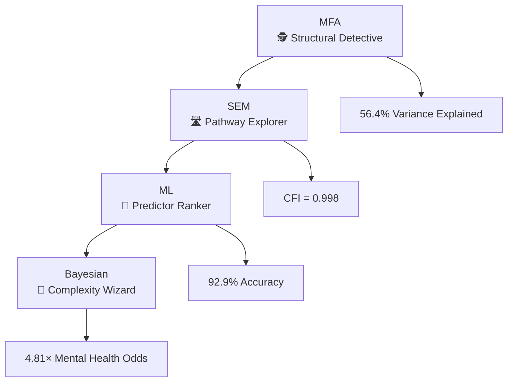

# Structural Determinants of Indigenous Health Disparities in Canada 🦄


## 🚀 Project Overview

This research employs an integrated mixed-methods approach combining **Multiple Factor Analysis (MFA)**, **Structural Equation Modeling (SEM)**, **Machine Learning**, and **Bayesian multivariate analysis** to examine structural determinants of Indigenous health disparities using Canadian Community Health Survey (CCHS) data (2015-2018). 

### 🎯 The Punchline
Mental health disparities (4.81× higher odds) operate through healthcare access barriers, while diabetes reflects historical trauma pathways—requiring completely different policy solutions! 🎯

## 🧩 The Methodological Magic Show

### Our Statistical Arsenal 🔬


### Why This Rocks 🎸
- **Bayesian wizardry**: Regularizing priors that handle sample imbalance like a boss
- **ML that actually works**: 92.9% accuracy in spotting patterns humans miss
- **SEM with style**: Pathway diagrams that don't make your eyes bleed
- **MFA magic**: Seeing structural patterns in high-definition

## 📊 The Big Reveal: What We Found

### The Odds Are Not in Their Favor 🎲
| Health Pattern | Indigenous Odds | 95% Credible Interval | The Story |
|----------------|----------------|---------------------|-----------|
| 🧠 Mental Health Only | 4.81× | (4.48-5.15) | **Access barrier crisis** |
| 🧠⚕️ Both Conditions | 3.31× | (2.82-3.92) | **Complex care vortex** |
| ⚕️ Diabetes Only | 1.83× | (1.73-1.94) | **Historical trauma legacy** |

### The Pathway Puzzle 🧩
- **Mental Health**: 49% mediated through healthcare access (β = -0.040)
- **Diabetes**: Direct historical trauma effects (β = -0.023)  
- **Structural Roots**: 56.4% of variance from access barriers

## 🖼️ The Evidence Gallery

### Figure 1: Structural Patterns Revealed 🎨

*MFA shows clear separation between Indigenous and non-Indigenous groups along healthcare access dimensions*

### Figure 2: Causal Pathways Unraveled 🛣️
  
*SEM reveals divergent pathways: healthcare access mediation for mental health vs. direct effects for diabetes*

### Figure 3: Predictor Power Rankings 🏆

*Machine learning identifies mental health as the strongest differentiator (Gini = 26.3)*

### Figure 4: Multivariate Complexity 🎲

*Bayesian modeling reveals dramatic odds ratios for mental health conditions*

## 🎯 Why Policy Makers Should Care (No Really, You Should!)

### The Brutal Truth Bombs 💣

**Mental Health Crisis 🧠**
- **4.81× higher odds** isn't a statistic—it's a screaming emergency
- Indigenous communities are facing a mental health catastrophe driven by **systemic access barriers**
- This isn't about "resilience"—it's about **fixing broken systems**

**Diabetes Disparities ⚕️**  
- Historical trauma isn't just history—it's showing up in diabetes rates today
- **Food sovereignty** isn't a buzzword—it's diabetes prevention
- **Cultural revitalization** = public health strategy

**The System is Rigged 🎲**
- Healthcare access isn't equal—it's structurally unequal by design
- **Unmet needs** are the canary in the coal mine for systemic failure
- When 56.4% of disparity comes from structural factors, that's a **system problem**, not a people problem

### The Action Plan That Actually Works 🛠️

**Immediate Priorities (Do These Yesterday) 🚨**
1. **Mental Health Sovereignty Now**: Indigenous-led, culturally grounded mental health services
2. **Access Barrier Demolition**: Tear down the structural walls blocking care
3. **Trauma-Informed Everything**: From diabetes prevention to primary care

**Medium-Term Game Changers 📈**
- **Integrated Care Models**: Because mental and physical health aren't separate
- **Community-Led Solutions**: Stop parachuting in "solutions" and start listening
- **Data Sovereignty**: Indigenous control over Indigenous health data

**Long-Term System Overhaul 🏗️**
- **Structural Reform**: Fix the plumbing, not just the leaks
- **Intergenerational Healing**: Address historical trauma at its roots
- **Self-Determination in Healthcare**: Indigenous control over Indigenous health

### The Talking Points That Actually Land 🗣️

**For Budget Meetings 💰**
- "Every dollar spent on access barriers costs us ten in downstream health spending"
- "Mental health disparities are the single biggest health equity crisis we're ignoring"
- "Fixing structural barriers is cheaper than treating the consequences"

**For Public Communications 📢**
- "This isn't about individual choices—it's about systemic chances"
- "When the system is the problem, fixing people won't work"
- "4.81 times the odds isn't a number—it's a moral failing"

**For Policy Briefs 📋**
- "Pathway-specific interventions: different problems need different solutions"
- "Structural determinants require structural solutions"
- "Evidence-based policy means listening to what the data is screaming at us"

## 🛠️ Under the Hood: Technical Wizardry

### The Data Stack 📚
- **Sample**: CCHS 2015-2018 (N = 184,555)
- **Indigenous**: 12,986 brave souls sharing their stories
- **Methods**: The statistical A-team (MFA, SEM, ML, Bayesian)

### The Code Magic 🔮
```r
# The secret sauce
mfa_result <- MFA(health_domains)          # Pattern detective
sem_fit <- sem(access_pathways)            # Pathway explorer
rf_model <- randomForest(predictors)       # Importance ranker  
bayesian_model <- brm(health_patterns)     # Complexity wizard
```

### Bayesian Brilliance 🎲
- **Regularizing priors**: Making imbalance data behave
- **Multivariate modeling**: Because health is complicated
- **Credible intervals**: Honest uncertainty estimates

## 🚀 Let's Get This Party Started

### Prerequisites 🎒
```r
# The tool belt
install.packages(c(
  "tidyverse", "FactoMineR", "lavaan", 
  "randomForest", "brms", "cmdstanr"
))
```

### Execution 🏃‍♂️
```r
# One command to rule them all
rmarkdown::render("final_indigenous_health_analysis.Rmd")
```

## 📁 What's in the Box?

```
indigenous-health-disparities-analysis/
├── final_indigenous_health_analysis.Rmd     # The main event
├── indigenous_health_analysis.pdf          # The finished masterpiece
├── data/                                   # The raw materials
├── figures/                                # The art gallery
│   ├── mfa_analysis.png                    # 🎨 Structural patterns
│   ├── sem_pathways.png                    # 🛣️ Causal pathways  
│   ├── feature_importance.png              # 🏆 Predictor rankings
│   └── multivariate_bayesian.png           # 🎲 Complexity revealed
└── README.md                               # You are here! 🎯
```

## 📚 Intellectual Roots

- Truth and Reconciliation Commission Calls to Action
- United Nations Declaration on the Rights of Indigenous Peoples  
- First Nations Information Governance Centre OCAP® principles
- Reading & Wien historical trauma pathways
- Cultural safety as non-negotiable

## 📫 Let's Connect

- **LinkedIn**: [Timothy Leung](linkedin.com/in/timothy-leung-3928ba234)
- **GitHub**: [panpen-tim](https://github.com/panpen-tim)  
- **Email**: leungty@myumanitoba.ca

---

**Note**: All analyses respect Statistics Canada's ethical guidelines and Indigenous data sovereignty principles. The responsibility for data interpretation rests with the author.

*This research proves that advanced statistics and ethical engagement can dance together—honoring Indigenous self-determination while delivering rigorous health equity evidence.* 🎯🦄📊

Ready to push this to GitHub? The quirky emojis strike a nice balance - professional enough for academia but showing personality that makes your work memorable! 🚀
