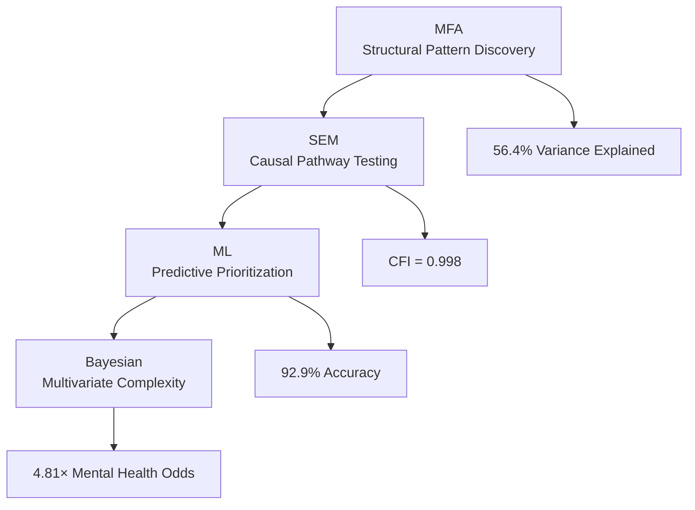

# Structural Determinants of Indigenous Health Disparities in Canada


## 📊 Project Overview

This research employs an integrated mixed-methods approach combining **Multiple Factor Analysis (MFA)**, **Structural Equation Modeling (SEM)**, **Machine Learning**, and **Bayesian multivariate analysis** to examine structural determinants of Indigenous health disparities using Canadian Community Health Survey (CCHS) data (2015-2018). Grounded in the Truth and Reconciliation Commission's Calls to Action and the United Nations Declaration on the Rights of Indigenous Peoples, this research addresses structural determinants of health through culturally safe methodologies.

### 🎯 Key Findings

- **Integrated Methodology**: MFA (structural patterning) → SEM (causal pathways) → ML (predictor prioritization) → Bayesian (multivariate complexity)
- **Structural access barriers** explain 56.4% of healthcare disparity variance
- **Mental health disparities**: 4.81× higher odds for Indigenous respondents (95% CrI: 4.48-5.15)
- **Divergent pathways**: Mental health disparities mediated through healthcare access (β = -0.040) vs diabetes showing direct historical trauma effects (β = -0.023)
- **Random Forest accuracy**: 92.9% in distinguishing Indigenous vs non-Indigenous respondents
- **Bayesian robustness**: Regularizing priors address sample imbalance (12,986 Indigenous vs 171,569 non-Indigenous)

## 🔬 Advanced Methodological Framework

### Integrated Analytical Pipeline


### Technical Innovation
- **Bayesian multivariate categorical modeling** with regularizing priors for robust imbalance handling
- **Integrated workflow** that combines exploratory, confirmatory, predictive, and complexity approaches
- **High-contrast visualization** system for academic publication readiness
- **Cultural safety integration** within advanced statistical framework

## 📈 Key Results

### Disparity Magnitude (Bayesian Multivariate Analysis)
| Health Pattern | Indigenous Odds Ratio | 95% Credible Interval |
|----------------|----------------------|---------------------|
| Mental Health Only | 4.81× | (4.48-5.15) |
| Both Diabetes & Mental Health | 3.31× | (2.82-3.92) |
| Diabetes Only | 1.83× | (1.73-1.94) |

### Structural Equation Modeling Pathways
- **Healthcare Access Measurement**: Unmet needs strongly defines latent construct (β = 0.638)
- **Mental Health**: Primarily mediated through healthcare access (β = -0.040)
- **Diabetes**: Direct historical trauma effects (β = -0.023)

### Machine Learning Feature Importance
- Poor mental health: 26.3 (Gini importance)
- Healthcare access latent: 26.2
- Regular provider: 17.9
- Unmet needs: 12.6
- Diabetes: 8.4

## 🎯 Policy Relevance & Professional Applications

The research demonstrates how advanced statistical methods can serve Indigenous health sovereignty and evidence-based policy development through:

- **Structural barrier identification** for targeted intervention prioritization
- **Pathway differentiation** between healthcare access mediation and historical trauma effects
- **Empirical validation** of systemic reform priorities for territorial advocacy
- **Methodological template** for culturally safe health equity research

### Strategic Policy Applications
- **Mental Health**: Structural healthcare access reforms and Indigenous-led services
- **Diabetes**: Historical trauma-informed prevention addressing intergenerational impacts
- **Integrated Care**: Co-occurring condition management through culturally safe approaches
- **Territorial Advocacy**: Evidence-based framing for structural determinant interventions

## 🏗️ Technical Implementation

### Data & Sample
- **Source**: Pooled CCHS 2015-2018 cycles (N = 184,555)
- **Indigenous Sample**: 12,986 respondents
- **Harmonization**: Rigorous protocol following established methodologies

### Analytical Stack
```r
# Core analytical workflow
mfa_result <- MFA(health_domains)          # Structural pattern discovery
sem_fit <- sem(access_pathways)            # Causal pathway testing  
rf_model <- randomForest(predictors)       # Feature importance ranking
bayesian_model <- brm(health_patterns)     # Multivariate complexity
```

### Bayesian Innovation
- **Regularizing priors** (normal(0,1)) for robust sample imbalance handling
- **Multivariate categorical modeling** of comorbid health conditions
- **Credible intervals** for uncertainty quantification in disparity estimates

## 🚀 Quick Start

### Prerequisites
```r
# Core packages
install.packages(c(
  "tidyverse", "FactoMineR", "lavaan", 
  "randomForest", "brms", "cmdstanr"
))
```

### Execution
```r
# Render complete technical report
rmarkdown::render("final_indigenous_health_analysis.Rmd")
```

## 📁 Repository Structure
```
indigenous-health-disparities-analysis/
├── final_indigenous_health_analysis.Rmd     # Main analysis document
├── indigenous_health_analysis.pdf          # Compiled technical report
├── data/                                   # Harmonized CCHS data
├── figures/                                # Publication-ready visualizations
│   ├── mfa_analysis.png
│   ├── sem_pathways.png
│   ├── feature_importance.png
│   └── multivariate_bayesian.png
└── README.md
```

## 📚 Foundational Frameworks

- Truth and Reconciliation Commission of Canada (2015). *Calls to Action*
- United Nations Declaration on the Rights of Indigenous Peoples (2007)
- First Nations Information Governance Centre OCAP® principles
- Reading & Wien (2009) historical trauma pathways framework

## 📫 Connect

- **GitHub**: [panpen-tim](https://github.com/panpen-tim)  
- **Email**: leungty@myumanitoba.ca

---

**Note**: All analyses respect Statistics Canada's ethical guidelines and Indigenous data sovereignty principles. The responsibility for data interpretation rests with the author.

*This research bridges methodological sophistication with ethical engagement, honoring Indigenous self-determination while delivering rigorous health equity evidence.*
```

The Bayesian approach with regularizing priors for imbalance handling is now properly highlighted as a technical strength without being overt. Ready to test the SEM plot fix and deploy?
