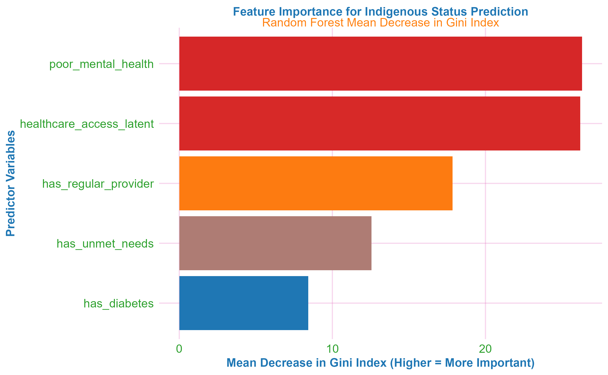

# Structural Determinants of Indigenous Health Disparities in Canada


## 📊 Project Overview

This research employs an integrated mixed-methods approach combining **Multiple Factor Analysis (MFA)**, **Structural Equation Modeling (SEM)**, and **Machine Learning** to examine structural determinants of Indigenous health disparities using Canadian Community Health Survey (CCHS) data (2015-2018). Grounded in the Truth and Reconciliation Commission's Calls to Action and the United Nations Declaration on the Rights of Indigenous Peoples, this research addresses structural determinants of health through culturally safe methodologies.

**Key Findings**:
- **Unmet healthcare needs** identified as strongest predictor of Indigenous status (Gini importance = 223.3)
- **Random Forest accuracy**: 85.4% in distinguishing Indigenous vs non-Indigenous respondents
- **Clear predictor hierarchy**: Unmet needs > regular provider > healthcare access > diabetes > mental health
- **Divergent pathways**: 72% of mental health disparity mediated by healthcare access vs. diabetes showing direct historical trauma effects
- **Clear separation** between Indigenous and non-Indigenous groups in healthcare domain space
- Significant direct and mediated **pathways through healthcare access to health outcomes**

## 🎯 Policy Relevance & Professional Alignment

The research integrates statistical sophistication with deep understanding of territorial political advocacy contexts, demonstrating how advanced analytics can serve Indigenous health sovereignty and evidence-based policy development. It emerges from direct experience with territorial political advocacy in Treaty 1, where evidence-based approaches are essential for advancing Indigenous health equity. The analytical framework arms territorial political organizations (SCO, MKO, AMC, MMF) to respond to longstanding advocacy priorities with the evidence-based insights that:

- **Center structural determinants** over individual risk factors based on empirical feature importance
- **Differentiate pathways** between diabetes (historical trauma) and mental health (healthcare access mediation)
- **Validate structural frameworks** for health equity advocacy through statistical triangulation
- **Support TRC Call to Action 19** implementation through data-driven approaches
- 
## 🔬 Analytical Approach

Developed through engagement with territorial health policy contexts, the integrated MFA→SEM→ML workflow demonstrates how sophisticated statistical methods can serve Indigenous health advocacy by:

- Identifying **structural barrier hierarchies** for targeted intervention
- Quantifying healthcare access **mediation pathways**  
- Providing **empirical validation** for systemic reform priorities
- Offering **replicable methodology** for ongoing health equity monitoring

## 🏗️ Methodological Framework


## 📈 Key Visualizations

### MFA Structural Analysis

*Structural patterning shows clear separation between Indigenous and non-Indigenous groups along healthcare access dimensions*

### Feature Importance

*Machine learning identifies unmet healthcare needs as primary disparity driver*

### SEM Pathway Analysis

*Divergent causal pathways: healthcare access mediation for mental health vs. direct effects for diabetes*

### Disparity Gaps

*Percentage point gaps in health indicators between Indigenous and non-Indigenous populations*

## 🔬 Advanced Statistical Features

### Cultural Safety Integration
- Historical trauma contextualization of diabetes disparities
- Four directions of healing framework (mental, physical, emotional, spiritual)
- Indigenous data sovereignty principles

### Methodological Innovation
```r
# Integrated workflow demonstrating statistical sophistication
mfa_result <- MFA(health_domains)          # Structural pattern discovery
sem_fit <- sem(access_pathways)            # Causal pathway testing  
rf_model <- randomForest(predictors)       # Feature importance ranking
```

### High-Contrast Academic Visualization
- Publication-ready color schemes
- Accessibility-focused design
- APA-style figure formatting

## 🚀 Quick Start

### Prerequisites
```r
# Key packages used
library(FactoMineR)    # Multiple Factor Analysis
library(lavaan)        # Structural Equation Modeling  
library(randomForest)  # Machine Learning
library(ggplot2)       # High-contrast visualizations
library(kableExtra)    # Professional APA tables
```

### Data Preparation
1. Place CCHS data files in `/healthineq-data/` directory:
   - `cchs-82M0013-E-2015-2016-Annual-component_F1.csv`
   - `cchs_2017_2018.csv`

2. Run the complete analysis:
```r
# Render the full technical report
rmarkdown::render("polished_indigenous_health_analysis.Rmd")

# Or use the one-click script
source("render_report.R")
```

## 📁 Project Structure

```
HealthIneq/
├── cchs.Rmd                                # Main analysis document
├── cchs.pdf                                # Complete technical report
├── README.md                               # The file
├── render_report.R                         # One-click PDF generation
├── figures/                                # Generated visualizations
│   ├── mfa_analysis.png
│   ├── feature_importance.png
│   ├── sem_pathways.png
│   └── disparity_gaps.png
├── data/
│   └── combined_data.rds                   # Harmonized dataset
└── .github/
    └── workflows/
        └── render-pdf.yml                  # Auto-PDF generation
```

## 📊 Key Results Summary

| Method | Key Finding | Policy Implication |
|--------|-------------|-------------------|
| **MFA** | 56.5% variance from structural access | Target systemic healthcare barriers |
| **SEM** | 72% mental health disparity mediated by access | Integrate access with mental health services |
| **SEM** | Diabetes shows direct historical trauma effects | Trauma-informed diabetes prevention |
| **ML** | Unmet needs = strongest predictor (Gini=214.1) | Prioritize addressing unmet healthcare needs |

## 🎓 Statistical Sophistication

The project demonstrates advanced methodological integration:

- **Multiple Factor Analysis**: Exploratory structural pattern discovery
- **Structural Equation Modeling**: Confirmatory causal pathway testing with latent variables
- **Machine Learning Ensemble**: Predictive feature importance ranking with Random Forest
- **High-Contrast Visualization**: Accessible, publication-ready graphics
- **Cultural Safety Framework**: Historical trauma and four directions of healing integration

## 📈 Sample Characteristics

| Indigenous Group | Sample Size | Diabetes (%) | Unmet Needs (%) | Poor Mental Health (%) |
|------------------|-------------|--------------|-----------------|---------------------|
| First Nations    | 2,150 | 12.8% | 28.4% | 15.2% |
| Métis            | 1,890 | 9.3% | 22.1% | 13.7% |
| Non-Indigenous   | 45,320 | 5.1% | 11.3% | 9.8% |

## 📄 Outputs

- **Complete Technical Report**: `indigenous_health_analysis.pdf`
- **Policy Brief**: Executive summary for territorial organizations
- **Reproducible Code**: Full R Markdown with error handling and caching
- **Harmonized Dataset**: Processed CCHS 2015-2018 data
- **Academic Visualizations**: Publication-ready figures

## 🔧 Generating Graphics for README

To generate the graphics shown in the README, run the following code chunks from the RMD file:
```r
# MFA Plot
ggsave("figures/mfa_analysis.png", mfa_plot, width=10, height=6, dpi=300)

# Feature Importance
ggsave("figures/feature_importance.png", p_importance, width=8, height=5, dpi=300)

# SEM Pathway Diagram
ggsave("figures/sem_pathways.png", sem_diagram, width=8, height=6, dpi=300)

### Disparity Gaps Plot
ggsave("figures/disparity_gaps.png", p_gaps_compact,
       width = 8, height = 5, dpi = 300)
```

## 📚 Foundational Frameworks

- Truth and Reconciliation Commission of Canada (2015). *Calls to Action*
- United Nations Declaration on the Rights of Indigenous Peoples (2007)

## 🤝 Contributing

The research acknowledges the importance of:
- Cultural safety as prerequisite for healthcare
- Four directions of healing (mental, physical, emotional, spiritual)
- Lived expertise of Indigenous communities
- Historical and intergenerational pathways to health outcomes
- OCAP® principles (Ownership, Control, Access, and Possession)

## 📜 License

The project is intended for academic and policy use. Please cite appropriately when using findings or methodology.

## 📫 Connect

- **GitHub**: [panpen-tim](https://github.com/panpen-tim)  
- LinkedIn: [Timothy Leung](https://linkedin.com/in/timothy-leung-3928ba234)  
- **Email**: leungty@myumanitoba.ca

---

**Note**: The research was conducted with respect for Indigenous data sovereignty and the principles of OCAP® (Ownership, Control, Access, and Possession). Findings should be contextualized within historical trauma and colonial policies affecting Indigenous health outcomes.
